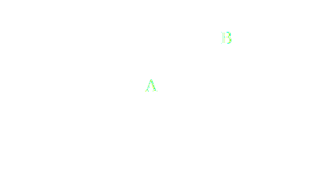
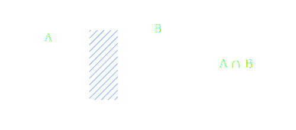
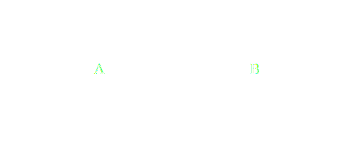
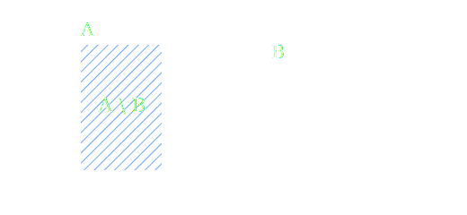
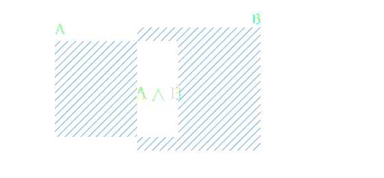
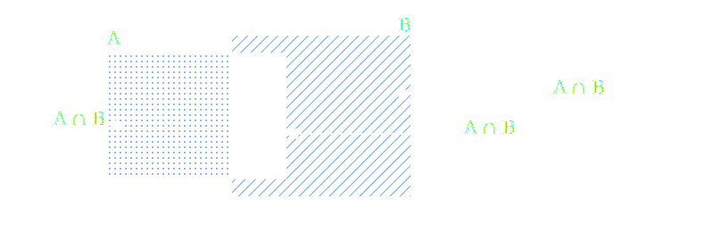

# Foundations of Probability

## Set Theory

### **Set**

A *set* is a collection of things. The things in a set are called
**elements**.

Example:\
If a set consists of the faces of a die, we could write:

    S = {1, 2, 3, 4, 5, 6}

Another example using set-builder notation:

$`S = {x : 1 \leq x \leq 6, x \in \mathbb{Z}}`$

This reads as "the set of all x such that x is greater than or equal to 1 and less than or equal to 96 where x is an integer."

### **Subsets**

A set (A) is a **subset** of (B) if every element of (A) is also in (B):

$ A \subseteq B $

### **Intersection**

$ A \cap B $

### **Disjoint Sets**

$ \ A \cap B = \varnothing $

### **Difference**

$A \setminus B = A \cap \overline{B}$

### **Symmetric Difference**

$A \triangle B = (A \cap B^c) \cup (B \cap A^c)$

$A \triangle B = (A \setminus B) \cup (B \setminus A)$

### **Union**

$$A \cup B = (A \cap B^c) \cup (A^c \cap B) \cup (A \cap B)$$
$$= A \setminus B \cup B \setminus A \cup (A \cap B)$$

### **Product of Two Sets**
If $A$ and $B$ are sets we can form the product $C$ as:

$$C = \{(a, b) : a \in A, b \in B\}$$

And we write:

$$C = A \times B$$

#### What This Means

The Cartesian product $A \times B$ is the set of all ordered pairs $(a, b)$ where:
- $a$ is an element from set $A$
- $b$ is an element from set $B$

#### Example

If $A = \{1, 2\}$ and $B = \{x, y, z\}$, then:

$$A \times B = \{(1,x), (1,y), (1,z), (2,x), (2,y), (2,z)\}$$

#### Grid Visualization

|     | x | y | z |
|-----|---|---|---|
| 1   | (1,x) | (1,y) | (1,z) |
| 2   | (2,x) | (2,y) | (2,z) |

#### Key Properties

- **Cardinality:** If $|A| = m$ and $|B| = n$, then $|A \times B| = m \times n$
- **Order matters:** $(a,b) \neq (b,a)$ unless $a = b$
- **Not commutative:** $A \times B \neq B \times A$ in general (unless $A = B$)
- **Associativity:** $(A \times B) \times C \neq A \times (B \times C)$
This starts with your definition and adds clear explanation, an example, visualization, and key properties. Would you like me to adjust the level of detail or add anything else?

## Basic Rules of Probability
### Probability that either of two events occurs P(AB)

$P(A \cup B) = P(A \cap B^c) + P(A^c \cap B) + P(A \cap B)$

Because the three sets on the right hand side are disjoint. We can get a similar result by adding

$P(A \cup B) = P(A) + P(B) - P(A \cap B)$

### Probability that both events occurs P(AB)

If we consider discrete probability then where every outcome is equally likely then the probability of A∩B is simply the number of outcomes is A∩B divided by the number of outcomes in the sample space Ω

$$P(A \cap B) = \frac{|A \cap B|}{|\Omega|}$$
The formula uses:
|A ∩ B| - cardinality (count) of elements in the intersection
|Ω| - cardinality of the sample space

### Conditional Probability P(A|B)
The conditional probability $P(A|B)$ is the probability that the event $A$ occurs given that the event $B$ has occurred. Of course for $A$ to occur given that $B$ has occurred, the two events $A$ and $B$ must share outcomes. We know that

$$P(A \cap B) = \frac{|A \cap B|}{|\Omega|}$$

But if we know that $B$ has occurred there is a higher probability than $P(A \cap B)$ that $A$ occurs because the extra information that $B$ has occurred allows us to reduce the sample space.

$$P(A|B) = \frac{P(A \cap B)}{P(B)}$$

Because

$$P(A|B) = \frac{|A \cap B|}{|B|} = \frac{|A \cap B|}{|B|} \div \frac{|\Omega|}{|\Omega|} = \frac{|A \cap B|}{|\Omega|} \div \frac{|B|}{|\Omega|} = \frac{P(A \cap B)}{P(B)}$$

### Multiplication Rule
Similarly if we are given $P(A_2 | A_1)$ we can covert it back to $P(A_1 \cap A_2)$ by multiplying it through by $P(A_1)$

$$P(A_1 \cap A_2) = P(A_2 | A_1)P(A_1)$$

We can extend this to three events

$$P(A_1 \cap A_2 \cap A_3) = P(A_3 | A_2 \cap A_1)P(A_2 \cap A_1)$$
$$= P(A_3 | A_2 \cap A_1)P(A_2 | A_1)P(A_1)$$

And then n events

$$P(A_1 \cap A_2 \cap \ldots \cap A_n) = P(A_1) \prod_{i=2}^{n} P(A_i | A_1 \cap A_2 \cap \ldots \cap A_{i-1})$$

Or equivalently:

$$P(A_1 \cap A_2 \cap \ldots \cap A_n) = P(A_n | A_{n-1} \cap \ldots \cap A_1)P(A_{n-1} | \ldots \cap A_1) \cdots P(A_2 | A_1)P(A_1)$$

### Partition Rule 

Any event $A$ can be partitioned into those outcomes it shares with a second event $B$ and those outcomes it doesn't share with $B$.

$$P(A) = P(A \cap B) + P(A \cap B^c)$$

We can express this using conditional probabilities as

$$P(A) = P(A | B)P(B) + P(A | B^c)P(B^c)$$
This is the **Law of Total Probability** for two events. It expresses the total probability of event $A$ as a weighted sum of conditional probabilities, where the weights are the probabilities of the conditioning events.

### Conditional Partition Rule
$$P(A|C) = P(A|B \cap C)P(B|C) + P(A|B^c \cap C)P(B^c|C)$$

This is the Law of Total Probability extended to three events. It expresses the conditional probability of $A$ given $C$ as a weighted sum of conditional probabilities, where the partition is based on event $B$ and all probabilities are conditioned on $C$.

For a proof of this consider the following

 $$ P(A|C) = \frac{P(A \cap C)}{P(C)} \tag{1}$$

But the set $A \cap C$ can be broken up into the part that intersects with a third set $B$ and the part that doesn't intersect with the third set $B$

$$A \cap C = (A \cap [C \cap B]) \cup (A \cap [C \cap B^c]) \tag{2}$$

  

So we can insert 2 into 1

$$P(A|C) = \frac{P(A \cap [(C \cap B) \cup (C \cap B^c)])}{P(C)} \tag{3}$$

Now we need to remember that $P(A \cap C \cap B) = P(A | C \cap B)P(C \cap B)$ we update the numerator on the RHS of 3

$$P(A|C) = \frac{P(A|C \cap B)P(C \cap B) + P(A|C \cap B)P(C \cap B^c)}{P(C)} \tag{4}$$

Finally we note that $P(C \cap B) = P(B|C)P(C)$ and use this to update the numerator on the RHS

$$P(A|C) = \frac{P(A|C \cap B)P(B|C)P(C) + P(A|C \cap B)P(B^c|C)P(C)}{P(C)} \tag{5}$$

Finally we cancel the $P(C)$'s

$$P(A|C) = P(A|C \cap B)P(B|C) + P(A|C \cap B)P(B^c|C) \tag{6}$$