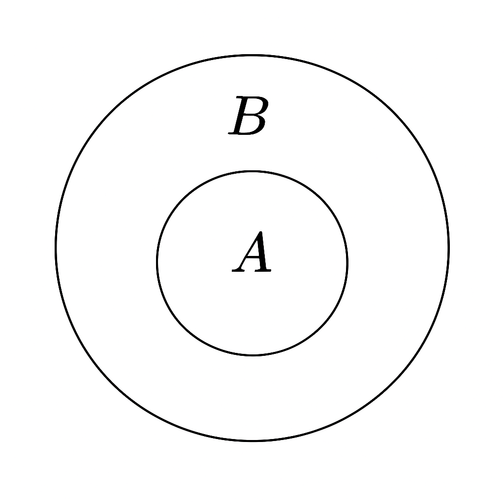

# Foundations of Probability

## Set Theory

### **Set**

A *set* is a collection of things. The things in a set are called
**elements**.

Example:\
If a set consists of the faces of a die, we could write:

    S = {1, 2, 3, 4, 5, 6}

Another example using set-builder notation:

$`S = {x : 1 \leq x \leq 6, x \in \mathbb{Z}}`$

This reads as "the set of all x such that x is greater than or equal to 1 and less than or equal to 96 where x is an integer."

### **Subsets**

A set (A) is a **subset** of (B) if every element of (A) is also in (B):

\[ A `\subseteq `{=tex}B \]

### **Intersection**

\[ A `\cap `{=tex}B \]

    +-------------+-------------+
    |             |             |
    |     A       |      B      |
    |      +------+------ +     |
    |      |   A ∩ B     |      |
    |      +-------------+      |
    +---------------------------+

TODO: Replace diagram with proper image

### **Disjoint Sets**

\[ A `\cap `{=tex}B = `\varnothing`{=tex} \]

    +-------+   +-------+
    |   A   |   |   B   |
    +-------+   +-------+

TODO: Replace diagram with proper image

### **Difference**

\[ A `\setminus `{=tex}B \]

    +-------------+
    |      B      |
    |   +------+  |
    | A | A\B |   |
    |   +------+  |
    +-------------+

TODO: Replace diagram with proper image

### **Symmetric Difference**

\[ A `\triangle `{=tex}B = (A `\setminus `{=tex}B) `\cup `{=tex}(B
`\setminus `{=tex}A) \]

    A-only     B-only
    +------+ +------+
    | A\B  | | B\A  |
    |      | |      |
    +------+ +------+

TODO: Replace diagram with proper image

### **Union**

\[ A `\cup `{=tex}B \]

    +-----------------------+
    |       A ∪ B           |
    |  +--------+--------+  |
    |  |   A    |    B   |  |
    |  +--------+--------+  |
    +-----------------------+

TODO: Replace diagram with proper image

### **Product of Two Sets**

\[ A `\times `{=tex}B = {(a,b)`\mid `{=tex}a`\in `{=tex}A,
b`\in `{=tex}B} \]

## Basic Rules of Probability

### **Probability that either of two events occurs**

\[ P(A `\cup `{=tex}B) = P(A) + P(B) - P(A `\cap `{=tex}B) \]

TODO: Replace diagram with proper image

### **Probability that both events occur**

\[ P(A `\cap `{=tex}B) = `\frac{|A \cap B|}{|\Omega|}`{=tex} \]

TODO: Replace diagram with proper image

## Conditional Probability

### **Definition**

\[ P(A `\mid `{=tex}B) = `\frac{P(A \cap B)}{P(B)}`{=tex} \]

TODO: Replace diagram with proper image

## Multiplication Rule

\[ P(A `\cap `{=tex}B) = P(A `\mid `{=tex}B)P(B) \]

\[ P(A `\cap `{=tex}B `\cap `{=tex}C) =
P(A)P(B`\mid `{=tex}A)P(C`\mid `{=tex}A`\cap `{=tex}B) \]

\[ P(A_1`\cap `{=tex}`\cdots `{=tex}`\cap `{=tex}A_n) =
`\prod`{=tex}*{k=1}\^n P(A_k
`\mid `{=tex}A_1`\cap `{=tex}`\cdots`{=tex}`\cap `{=tex}A*{k-1}) \]

## Partition Rule

\[ A = (A `\cap `{=tex}B) `\cup `{=tex}(A `\cap `{=tex}B\^c) \]

TODO: Replace diagram with proper image

## Conditional Partition Rule

\[ P(A `\mid `{=tex}C) = P(B `\mid `{=tex}C)P(A `\mid `{=tex}B
`\cap `{=tex}C) + P(B\^c `\mid `{=tex}C)P(A `\mid `{=tex}B\^c
`\cap `{=tex}C) \]

TODO: Replace diagram with proper image
