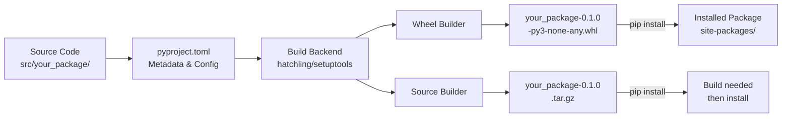
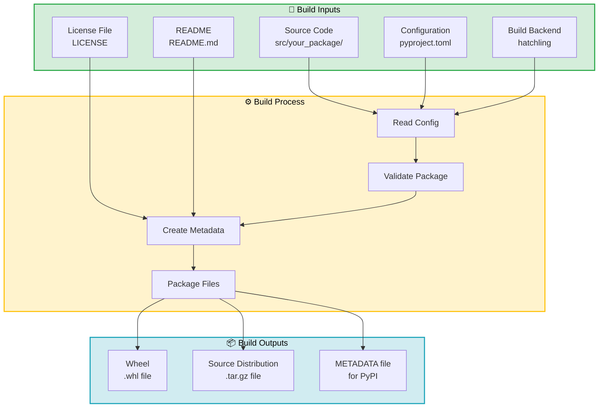

# ⚙️ Modern Python Project Setup (2025)

In 2025, Python project setup has evolved to use standardized tools and conventions. This guide covers modern project structure, dependency management, code quality tools, and professional workflows that are now industry standard.

**← Back to**: [Python Fundamentals](./README.md)

---

## 📚 What You'll Learn

### Modern Project Structure (src-layout)

The **src-layout** is now the recommended standard for Python projects, endorsed by the Python Packaging Authority.

**Recommended Directory Structure:**

```
your-project/
├── src/
│   └── your_package/
│       ├── __init__.py
│       ├── core.py
│       ├── utils.py
│       └── api/
│           ├── __init__.py
│           └── routes.py
├── tests/
│   ├── __init__.py
│   ├── test_core.py
│   └── test_api/
│       └── test_routes.py
├── docs/
│   └── index.md
├── pyproject.toml
├── .gitignore
├── .editorconfig
├── .pre-commit-config.yaml
└── README.md
```

**Why src-layout?**

| Benefit | Explanation |
|---------|-------------|
| **Import Testing** | Tests run against *installed* package, not local files |
| **No Accidental Imports** | Prevents importing from working directory |
| **Industry Standard** | Used by FastAPI, Pydantic, pip, etc. |
| **Build Tool Friendly** | Works seamlessly with modern build backends |

**Flat layout (old style, not recommended):**

```
# Avoid this structure
your-project/
├── your_package/  # <- Package at root (problematic)
│   ├── __init__.py
│   └── core.py
```

**Why not flat layout?**
- Tests might accidentally import uninstalled version
- Confuses build tools
- Not PEP 517 compliant

---

### pyproject.toml (PEP 621)

The `pyproject.toml` file is now the single source of truth for Python project metadata, replacing `setup.py`, `setup.cfg`, and `requirements.txt`.

**Complete Example:**

```toml
[build-system]
requires = ["hatchling>=1.25"]
build-backend = "hatchling.build"

[project]
name = "your-project"
version = "0.1.0"
description = "A modern Python project"
readme = "README.md"
requires-python = ">=3.11"
license = {text = "MIT"}
authors = [
    {name = "Your Name", email = "you@example.com"}
]
keywords = ["example", "project"]
classifiers = [
    "Development Status :: 3 - Alpha",
    "Intended Audience :: Developers",
    "License :: OSI Approved :: MIT License",
    "Programming Language :: Python :: 3",
    "Programming Language :: Python :: 3.11",
    "Programming Language :: Python :: 3.12",
    "Programming Language :: Python :: 3.13",
]

dependencies = [
    "requests>=2.28.0",
    "pydantic>=2.0.0",
]

[project.optional-dependencies]
dev = [
    "pytest>=7.0",
    "pytest-cov>=4.0",
    "mypy>=1.0",
    "ruff>=0.1.0",
    "pre-commit>=3.0",
]
docs = [
    "mkdocs>=1.4.0",
    "mkdocs-material>=9.0",
]

[project.urls]
Homepage = "https://github.com/yourusername/your-project"
Documentation = "https://your-project.readthedocs.io"
Repository = "https://github.com/yourusername/your-project"
"Bug Tracker" = "https://github.com/yourusername/your-project/issues"

[tool.hatch.build.targets.wheel]
packages = ["src/your_package"]

[tool.pytest.ini_options]
testpaths = ["tests"]
addopts = "--cov=your_package --cov-report=html --cov-report=term"

[tool.mypy]
python_version = "3.11"
strict = true
warn_return_any = true
warn_unused_configs = true

[tool.ruff]
target-version = "py311"
line-length = 100

[tool.ruff.lint]
select = ["E", "F", "W", "I", "N", "UP", "B", "A"]
ignore = ["E501"]  # Line length (ruff format handles this)

[tool.ruff.format]
line-length = 100
```

**Build Backend Options:**

| Backend | Best For | Pros | Cons |
|---------|----------|------|------|
| **Hatchling** | Most projects | Fast, minimal config, PEP 621 | Fewer plugins |
| **Poetry** | Full dependency management | Lock files, resolver | Slower, complex |
| **PDM** | Modern workflow | Fast, PEP 582 support | Less mature |
| **Setuptools** | Legacy compatibility | Widespread, mature | Verbose config |
| **Flit** | Simple packages | Minimal, fast | Limited features |

**What Does a Build Backend Do?**

A Python build backend is a tool that converts your project source code into distributable packages (wheels and source distributions). When you run `pip install -e .` or `python -m build`, the build backend handles all the packaging work behind the scenes.

**Core Functions:**

1. **Reads Project Metadata** - Parses `pyproject.toml` to understand your project structure, dependencies, and version
2. **Locates Source Code** - Finds files in `src/` layout and validates the package structure
3. **Builds Distributions**:
   - **Wheel** (.whl) - Binary, installable package
   - **Source distribution** (.tar.gz) - Raw source with metadata
4. **Handles Dependencies** - Includes dependency information so pip knows what to install alongside your package
5. **Configures Entry Points** - Sets up CLI commands and other executable entry points

**How It Works:**

```
Your Project (src/your_package/)
        ↓
pyproject.toml specifies:
build-backend = "hatchling.build"
        ↓
Hatchling reads config, locates source code
        ↓
Creates two files:
- dist/your_package-0.1.0-py3-none-any.whl
- dist/your_package-0.1.0.tar.gz
        ↓
Ready for: pip install, PyPI upload, etc.
```

**You Don't Call It Directly** - The backend runs automatically:

```bash
python -m build              # Automatically uses your configured backend
pip install -e .             # Uses backend to create editable install
poetry build                 # Poetry calls its backend internally
```

---

### Understanding Wheels

A **wheel** is a pre-built Python package format that contains everything needed to install your package. Think of it like a compiled binary, but for Python.

**What is a Wheel?**

A wheel (`.whl` file) is a ZIP archive containing:
- Your compiled Python code (or source code)
- Metadata about the package (name, version, dependencies)
- Installation scripts
- Configuration files

**Wheel vs Source Distribution:**

| Aspect | Wheel (.whl) | Source Distribution (.tar.gz) |
|--------|------|------------|
| **Speed** | Fast to install (no compilation) | Slower (may need compilation) |
| **Content** | Pre-built, ready to use | Raw source code |
| **Compatibility** | Specific to Python version/OS | Works on any platform |
| **Use Case** | End users installing packages | Distribution, archival |
| **Size** | Smaller (no build files) | Larger (includes all source) |

**Inside a Wheel File:**

```
your_package-0.1.0-py3-none-any.whl
├── your_package/
│   ├── __init__.py
│   ├── core.py
│   ├── utils.py
│   └── api/
│       ├── __init__.py
│       └── routes.py
├── your_package-0.1.0.dist-info/
│   ├── METADATA              # Package metadata
│   ├── WHEEL                 # Wheel format version
│   ├── RECORD                # List of all files
│   ├── entry_points.txt      # CLI commands (if any)
│   └── top_level.txt         # Top-level package name
└── (other Python 3 files)
```

**Wheel Naming Convention:**

```
your_package-0.1.0-py3-none-any.whl
     ↓         ↓  ↓  ↓   ↓
  package    version │  │   └─ Platform (any = all)
           Python tag │  └───── ABI tag (none = pure Python)
                      └──────── Implementation tag (py3)
```

**Example Names:**

```
# Pure Python, works on all platforms
requests-2.31.0-py3-none-any.whl

# Specific Python version
numpy-1.26.4-cp312-cp312-macosx_13_x86_64.whl

# Windows specific
pillow-10.0.0-cp311-cp311-win_amd64.whl
```

**Why Wheels?**

- ✅ **Fast Installation** - No compilation needed, pip just extracts files
- ✅ **Reproducibility** - Same package works identically across machines
- ✅ **Smaller Size** - Pre-built, no extraneous files
- ✅ **Offline Installation** - Download once, install many times
- ✅ **Better Security** - Pre-compiled, less attack surface than raw source

**Build Process (Visual):**



**Build Inputs and Outputs:**



**Creating Wheels:**

```bash
# Install build tools
pip install build

# Build both wheel and source distribution
python -m build

# Contents of dist/ directory
ls dist/
# Output:
# your_package-0.1.0-py3-none-any.whl
# your_package-0.1.0.tar.gz
```

**Installing from Wheel:**

```bash
# From wheel (fast, no compilation)
pip install dist/your_package-0.1.0-py3-none-any.whl

# From source distribution (slower, may compile)
pip install dist/your_package-0.1.0.tar.gz

# From PyPI (pip finds wheels automatically)
pip install your_package
```

**Inspecting a Wheel:**

```bash
# Wheels are just ZIP files
unzip -l your_package-0.1.0-py3-none-any.whl

# Or use zipfile module
python -m zipfile -l your_package-0.1.0-py3-none-any.whl
```

---

### Package Organization

**Using `__init__.py` for Public API:**

```python
# src/your_package/__init__.py
from your_package.core import main_function, Config
from your_package.utils import helper_one, helper_two

__version__ = "0.1.0"
__all__ = ["main_function", "Config", "helper_one", "helper_two"]
```

Now users can import:

```python
from your_package import main_function  # Clean API
# Instead of:
from your_package.core import main_function  # Implementation detail
```

**Import Styles:**

```python
# Absolute imports (recommended for clarity)
from your_package.core import add
from your_package.utils.validators import validate_email

# Relative imports (use sparingly, within same package)
# In your_package/api/handlers.py:
from . import models  # Same level
from ..core import config  # Parent level
```

**Best Practices:**
- Use absolute imports by default
- Keep relative imports within the same package
- Avoid importing from outside your package using relative imports
- Use `__all__` to define public API

---

### Version Management: `__init__.py` vs `pyproject.toml`

**The Problem: Two Places for Version?**

You'll see version numbers in two places:

```python
# src/your_package/__init__.py
__version__ = "0.1.0"
```

```toml
# pyproject.toml
[project]
version = "0.1.0"
```

This looks like duplication, but they serve different purposes:

**`pyproject.toml` version** (Primary Source of Truth)
- **Used by**: Build tools, package managers, PyPI
- **When it's read**: When building and publishing
- **What it does**: Tells pip/PyPI what version you're distributing
- **Required**: Yes, absolutely required

```toml
[project]
name = "your-package"
version = "0.1.0"  # This is what PyPI publishes as
```

**`__init__.py` version** (User-Facing)
- **Used by**: Your users, your code, runtime checks
- **When it's read**: When someone imports your package
- **What it does**: Users can check what version they installed
- **Required**: Optional but highly recommended

```python
import your_package
print(your_package.__version__)  # Users see "0.1.0"
```

**The Relationship:**

| Aspect | pyproject.toml | __init__.py |
|--------|---|---|
| **Purpose** | Package distribution metadata | Runtime version info |
| **Read by** | Build tools, pip, PyPI | Users, documentation |
| **When used** | At build/publish time | At runtime |
| **Can be missing?** | NO - required | YES - optional but recommended |
| **Example use** | `pip install your-package==0.1.0` | `import your_package; your_package.__version__` |

**Best Practice: Keep Them In Sync**

```
Update version in pyproject.toml
        ↓
Update version in __init__.py
        ↓
Build and publish
```

**Approach 1: Manual (Simple Projects)**

Update both files:
```bash
# 1. Update pyproject.toml
vim pyproject.toml
# Change: version = "0.1.0" → version = "0.2.0"

# 2. Update __init__.py
vim src/your_package/__init__.py
# Change: __version__ = "0.1.0" → __version__ = "0.2.0"

# 3. Commit and tag
git add .
git commit -m "Bump version to 0.2.0"
git tag v0.2.0
```

**Approach 2: Dynamic (Recommended for Professional Projects)**

Read version from `__init__.py` in `pyproject.toml`:

```toml
# pyproject.toml - single source of truth
[project]
name = "your-package"
version = {attr = "your_package.__version__"}  # Read from __init__.py
description = "My package"
```

```python
# src/your_package/__init__.py
__version__ = "0.2.0"  # Single place to update!
```

Now update only `__init__.py`, and `pyproject.toml` automatically reads it.

**Approach 3: Using a Version File (Large Projects)**

Some projects keep version in a separate file:

```python
# src/your_package/_version.py
__version__ = "0.2.0"
```

```python
# src/your_package/__init__.py
from your_package._version import __version__
```

```toml
# pyproject.toml
[project]
version = {attr = "your_package._version.__version__"}
```

**Why Keep Both?**

Without `__version__` in `__init__.py`:
```python
import requests
print(requests.__version__)  # AttributeError - not available!
```

With `__version__` in `__init__.py`:
```python
import requests
print(requests.__version__)  # "2.31.0" ✓
```

**Practical Example: Version Release Workflow**

```bash
# Current state
# pyproject.toml: version = {attr = "your_package.__version__"}
# __init__.py: __version__ = "0.1.0"

# Step 1: Update version once
sed -i 's/__version__ = "0.1.0"/__version__ = "0.2.0"/' src/your_package/__init__.py

# Step 2: Build (pyproject.toml automatically picks up new version)
python -m build

# Step 3: Check what will be published
ls dist/
# Output:
# your_package-0.2.0-py3-none-any.whl
# your_package-0.2.0.tar.gz

# Step 4: Publish
twine upload dist/*

# Users can verify version:
# pip install your-package==0.2.0
# python -c "import your_package; print(your_package.__version__)"
# Output: 0.2.0 ✓
```

**Quick Decision Guide:**

- **Single source of truth**: Use `{attr = "your_package.__version__"}` in `pyproject.toml`
- **Simple projects**: Manual updates to both files (just be careful)
- **Complex projects**: Use a dedicated `_version.py` file
- **Never use**: Different versions in the two files - causes confusion and bugs!

---

### Development Environment Setup

**Creating a New Project:**

```bash
# Create project directory
mkdir your-project && cd your-project

# Create virtual environment
python -m venv .venv

# Activate (Linux/macOS)
source .venv/bin/activate

# Activate (Windows)
.venv\Scripts\activate

# Upgrade pip and build tools
pip install --upgrade pip wheel setuptools

# Create src layout
mkdir -p src/your_package tests
touch src/your_package/__init__.py
touch pyproject.toml README.md
```

**Editable Install (`-e`):**

```bash
# Install package in development mode
pip install -e .

# Now you can edit code and changes are immediately available
# No need to reinstall after every change

# With optional dependencies
pip install -e ".[dev,docs]"
```

**Why editable install?**
- Changes to source code are immediately reflected
- Package is installed from your local directory
- Ideal for active development
- Tests always run against current code

---

### Modern Code Quality Tools

**Ruff - The All-in-One Tool (2024+)**

Ruff combines linting, formatting, and import sorting in a single, blazingly fast tool. It's becoming the de facto standard in the Python community.

```bash
# Install
pip install ruff

# Lint code (check for issues)
ruff check .

# Auto-fix issues
ruff check --fix .

# Format code (Black-compatible)
ruff format .

# Check before committing (read-only)
ruff check . && ruff format --check .
```

**Ruff vs Other Tools:**
- `ruff check` replaces pylint, flake8, isort, and others
- `ruff format` replaces Black
- Much faster than previous tools
- Single tool, no config conflicts

**Type Checking with mypy:**

```bash
# Install
pip install mypy

# Run type checker
mypy src

# Strict mode (recommended)
mypy --strict src

# Check specific file
mypy src/your_package/core.py
```

**Example Typed Code:**

```python
# src/your_package/core.py
from typing import Optional
from pydantic import BaseModel

class Config(BaseModel):
    """Application configuration."""
    name: str
    debug: bool = False
    timeout: Optional[int] = None

def main_function(name: str, value: int) -> str:
    """Process data and return result."""
    if value < 0:
        raise ValueError("Value must be positive")
    return f"{name}: {value}"

# Type checking catches these errors:
# result = main_function(123, "invalid")  # Error: wrong types
# config = Config(name=123)  # Error: name must be str
```

---

### Testing with pytest

**Basic Test Structure:**

```python
# tests/test_core.py
import pytest
from your_package.core import main_function, Config

def test_main_function():
    """Test main function with valid input."""
    result = main_function("test", 42)
    assert result == "test: 42"

def test_main_function_invalid():
    """Test that invalid input raises ValueError."""
    with pytest.raises(ValueError, match="Value must be positive"):
        main_function("test", -1)

def test_config_creation():
    """Test Config model creation."""
    config = Config(name="myapp", debug=True)
    assert config.name == "myapp"
    assert config.debug is True

@pytest.fixture
def sample_config():
    """Fixture providing a sample config."""
    return Config(name="test-app")

def test_with_fixture(sample_config):
    """Test using a fixture."""
    assert sample_config.name == "test-app"
```

**Run Tests:**

```bash
# Run all tests
pytest

# Run with coverage report
pytest --cov=your_package

# Generate HTML coverage report
pytest --cov=your_package --cov-report=html

# Verbose output
pytest -v

# Run specific test
pytest tests/test_core.py::test_main_function

# Stop on first failure
pytest -x

# Run only failing tests from last run
pytest --lf
```

---

### Pre-commit Hooks

Pre-commit hooks run checks automatically before each commit, preventing issues from being committed.

**`.pre-commit-config.yaml`:**

```yaml
repos:
  - repo: https://github.com/astral-sh/ruff-pre-commit
    rev: v0.3.0
    hooks:
      - id: ruff
        args: ["--fix"]
      - id: ruff-format

  - repo: https://github.com/pre-commit/pre-commit-hooks
    rev: v4.5.0
    hooks:
      - id: trailing-whitespace
      - id: end-of-file-fixer
      - id: check-yaml
      - id: check-added-large-files
        args: ["--maxkb=1000"]

  - repo: https://github.com/pre-commit/mirrors-mypy
    rev: v1.8.0
    hooks:
      - id: mypy
        additional_dependencies: ["pydantic"]
```

**Setup:**

```bash
# Install pre-commit
pip install pre-commit

# Install git hooks
pre-commit install

# Run manually on all files
pre-commit run --all-files

# Update hooks to latest versions
pre-commit autoupdate

# Bypass hooks (use rarely, only when necessary)
git commit --no-verify
```

---

### Continuous Integration (GitHub Actions)

**`.github/workflows/ci.yml`:**

```yaml
name: CI

on:
  push:
    branches: [main]
  pull_request:
    branches: [main]

jobs:
  test:
    runs-on: ${{ matrix.os }}
    strategy:
      matrix:
        os: [ubuntu-latest, macos-latest, windows-latest]
        python-version: ["3.11", "3.12", "3.13"]

    steps:
      - uses: actions/checkout@v4

      - name: Set up Python ${{ matrix.python-version }}
        uses: actions/setup-python@v5
        with:
          python-version: ${{ matrix.python-version }}

      - name: Install dependencies
        run: |
          python -m pip install --upgrade pip
          pip install -e ".[dev]"

      - name: Lint with ruff
        run: |
          ruff check .
          ruff format --check .

      - name: Type check with mypy
        run: mypy src

      - name: Test with pytest
        run: pytest --cov=your_package --cov-report=xml

      - name: Upload coverage
        uses: codecov/codecov-action@v4
        if: matrix.os == 'ubuntu-latest' && matrix.python-version == '3.12'
        with:
          file: ./coverage.xml
          fail_ci_if_error: true
```

**What This Does:**
- Runs tests on 3 OSes × 3 Python versions (9 test matrices)
- Lints code with ruff
- Type checks with mypy
- Runs pytest with coverage
- Uploads coverage to Codecov
- Fails if coverage drops significantly

---

### Building and Publishing

**Build Your Package:**

```bash
# Install build tools
pip install build twine

# Build distributions
python -m build

# Creates:
# dist/your_project-0.1.0.tar.gz (source distribution)
# dist/your_project-0.1.0-py3-none-any.whl (wheel)
```

**Publish to PyPI:**

```bash
# Test on TestPyPI first (recommended)
twine upload --repository testpypi dist/*

# Install from TestPyPI to verify
pip install --index-url https://test.pypi.org/simple/ your-project

# Publish to PyPI (production)
twine upload dist/*

# Set up PyPI token in ~/.pypirc for authentication
# [testpypi]
# repository = https://test.pypi.org/legacy/
# username = __token__
# password = pypi-AgEIcHl...
```

**Version Management:**

```toml
# pyproject.toml - single source of truth
[project]
version = "0.1.0"

# Or use dynamic versioning from __init__.py
# version = {attr = "your_package.__version__"}

# Then in src/your_package/__init__.py:
# __version__ = "0.1.0"
```

**Semantic Versioning:**
- `0.1.0` = `MAJOR.MINOR.PATCH`
- `0.1.0` = Pre-release (unstable)
- `1.0.0` = First stable release
- `1.2.3` = 1 = breaking change, 2 = new feature, 3 = bug fix

---

### Essential Configuration Files

**`.gitignore`:**

```
# Python
__pycache__/
*.py[cod]
*$py.class
*.so
.Python

# Virtual environments
.venv/
venv/
ENV/
env/

# Distribution
build/
dist/
*.egg-info/
*.egg

# Testing
.pytest_cache/
.coverage
coverage.xml
htmlcov/

# IDE
.vscode/
.idea/
*.swp
*.swo
*.sublime-workspace

# OS
.DS_Store
Thumbs.db

# Project specific
.env
.env.local
```

**`.editorconfig`:**

```ini
root = true

[*]
charset = utf-8
end_of_line = lf
insert_final_newline = true
trim_trailing_whitespace = true

[*.py]
indent_style = space
indent_size = 4
max_line_length = 100

[*.{yaml,yml,toml}]
indent_style = space
indent_size = 2

[Makefile]
indent_style = tab
```

**`README.md` Template:**

```markdown
# Your Project

One-line description of your project.

## Features

- Feature 1
- Feature 2
- Feature 3

## Installation

```bash
pip install your-project
```

## Quick Start

```python
from your_package import main_function

result = main_function("hello", 42)
print(result)
```

## Development

```bash
# Clone repository
git clone https://github.com/yourusername/your-project.git
cd your-project

# Create virtual environment
python -m venv .venv
source .venv/bin/activate  # Linux/macOS
.venv\Scripts\activate     # Windows

# Install in development mode
pip install -e ".[dev]"

# Run tests
pytest

# Run linter and formatter
ruff check . && ruff format .
```

## Documentation

See [docs/](./docs/) for detailed documentation.

## License

MIT License - see [LICENSE](LICENSE) file.

---

### Best Practices Summary

| Practice | Tool/Method | Why |
|----------|-------------|-----|
| **Project Structure** | src-layout | Prevents import issues, industry standard |
| **Dependency Management** | pyproject.toml | Modern standard (PEP 621) |
| **Isolation** | venv | Avoid system conflicts |
| **Linting** | ruff check | Fast, comprehensive, single tool |
| **Formatting** | ruff format | Consistent style, Black-compatible |
| **Type Checking** | mypy | Catch bugs early, improve code quality |
| **Testing** | pytest | Feature-rich, simple, widely used |
| **Coverage** | pytest-cov | Track tested code, aim for >80% |
| **Pre-commit** | pre-commit | Auto-enforce quality before commits |
| **CI/CD** | GitHub Actions | Automate checks on push and PR |
| **Documentation** | MkDocs | Easy markdown docs with nice theme |
| **Publishing** | build + twine | Standard PyPI workflow |

---

## �� Learning Resources

### Official Documentation

- [Python Packaging User Guide](https://packaging.python.org/) - Official packaging guide
- [PEP 621 - pyproject.toml](https://peps.python.org/pep-0621/) - Project metadata standard
- [PEP 517 - Build Backend](https://peps.python.org/pep-0517/) - Build system specification
- [pytest Documentation](https://docs.pytest.org/) - Testing framework
- [mypy Documentation](https://mypy.readthedocs.io/) - Type checker reference

### Modern Tools

- [Ruff Documentation](https://docs.astral.sh/ruff/) - Linter and formatter
- [Hatchling](https://hatch.pypa.io/latest/) - Modern build backend
- [uv](https://github.com/astral-sh/uv) - Fast Python package installer
- [pre-commit](https://pre-commit.com/) - Git hook framework

### Project Structure

- [Packaging Python Projects](https://packaging.python.org/en/latest/tutorials/packaging-projects/) - Official tutorial
- [Hypermodern Python](https://cjolowicz.github.io/posts/hypermodern-python-01-setup/) - Comprehensive series
- [src-layout vs flat-layout](https://packaging.python.org/en/latest/discussions/src-layout-vs-flat-layout/) - Layout comparison

### Best Practices

- [Real Python: Project Setup](https://realpython.com/pypi-publish-python-package/) - Publishing guide
- [Python Project Template](https://github.com/rochacbruno/python-project-template) - Reference template
- [Scientific Python Development Guide](https://learn.scientific-python.org/development/) - Advanced practices

### CI/CD & Automation

- [GitHub Actions for Python](https://docs.github.com/en/actions/automating-builds-and-tests/building-and-testing-python) - Official guide
- [Codecov](https://about.codecov.io/) - Coverage reporting
- [Read the Docs](https://docs.readthedocs.io/) - Documentation hosting

### Alternative Tools

- [Poetry](https://python-poetry.org/) - Dependency management and packaging
- [PDM](https://pdm-project.org/) - Modern package manager
- [Flit](https://flit.pypa.io/) - Simple packaging tool

---

## ✅ Learning Checklist

### Project Setup

- [ ] Create project with src-layout directory structure
- [ ] Create `src/your_package/__init__.py` to mark as package
- [ ] Create `tests/` directory for test files
- [ ] Set up virtual environment: `python -m venv .venv`
- [ ] Activate virtual environment
- [ ] Upgrade pip: `pip install --upgrade pip wheel setuptools`

### pyproject.toml Configuration

- [ ] Create `pyproject.toml` with `[build-system]` section
- [ ] Add project metadata: name, version, description, authors
- [ ] Set `requires-python` version (e.g., `>=3.11`)
- [ ] Define runtime dependencies in `dependencies = []`
- [ ] Add dev dependencies in `[project.optional-dependencies]`
- [ ] Configure build backend (hatchling, poetry, or setuptools)
- [ ] Install in editable mode: `pip install -e ".[dev]"`

### Code Organization

- [ ] Understand package vs module distinction
- [ ] Use `__init__.py` to expose public API
- [ ] Practice absolute imports for clarity
- [ ] Avoid deep nesting (max 2-3 levels)
- [ ] Separate `src/`, `tests/`, `docs/` directories

### Code Quality Tools

- [ ] Install ruff: `pip install ruff`
- [ ] Run linter: `ruff check .`
- [ ] Auto-fix issues: `ruff check --fix .`
- [ ] Format code: `ruff format .`
- [ ] Install mypy: `pip install mypy`
- [ ] Run type checker: `mypy src`
- [ ] Configure tools in `[tool.ruff]` and `[tool.mypy]` sections

### Testing

- [ ] Install pytest: `pip install pytest pytest-cov`
- [ ] Write first test in `tests/test_*.py`
- [ ] Run tests: `pytest`
- [ ] Run with coverage: `pytest --cov=your_package`
- [ ] Generate HTML coverage report: `pytest --cov --cov-report=html`
- [ ] Understand pytest fixtures for reusable test data
- [ ] Configure pytest in `[tool.pytest.ini_options]`

### Pre-commit Hooks

- [ ] Create `.pre-commit-config.yaml`
- [ ] Install pre-commit: `pip install pre-commit`
- [ ] Enable hooks: `pre-commit install`
- [ ] Run manually: `pre-commit run --all-files`
- [ ] Commit changes to verify hooks run automatically
- [ ] Add hooks for ruff, mypy, and common checks

### Version Control

- [ ] Initialize git: `git init`
- [ ] Create `.gitignore` with Python patterns
- [ ] Stage files: `git add .`
- [ ] Commit: `git commit -m "Initial commit"`
- [ ] Create GitHub repository
- [ ] Push to remote: `git push -u origin main`

### Continuous Integration

- [ ] Create `.github/workflows/ci.yml`
- [ ] Add jobs for linting, type checking, and testing
- [ ] Test on multiple Python versions (3.11, 3.12, 3.13)
- [ ] Test on multiple OS (ubuntu, macos, windows)
- [ ] Add coverage reporting with Codecov
- [ ] Verify CI runs on push and PR

### Documentation

- [ ] Write clear README.md with usage examples
- [ ] Add docstrings to all public functions and classes
- [ ] (Optional) Set up MkDocs for documentation site
- [ ] (Optional) Deploy docs to Read the Docs or GitHub Pages

### Building & Publishing

- [ ] Install build tools: `pip install build twine`
- [ ] Build package: `python -m build`
- [ ] Verify dist/ contains .tar.gz and .whl files
- [ ] Test upload to TestPyPI: `twine upload --repository testpypi dist/*`
- [ ] Install from TestPyPI to verify
- [ ] Publish to PyPI: `twine upload dist/*`

### Validation

- [ ] **Test**: Create new project from scratch following all steps
- [ ] **Test**: Write code, tests, and verify coverage >80%
- [ ] **Test**: Run pre-commit hooks and verify they catch issues
- [ ] **Test**: Make a PR and verify CI passes all checks
- [ ] **Test**: Build package and install locally
- [ ] **Test**: Publish to TestPyPI successfully

---

## 📖 Complete Tutorial

Want to see all of this in action? Check out the **[Complete Modern Python Project Tutorial](./complete-modern-project-tutorial.md)**, which walks through building a professional Python package from scratch, including:

- Modern project setup with src-layout
- Writing comprehensive tests
- Setting up code quality tools
- Configuring CI/CD with GitHub Actions
- Publishing to PyPI
- Installing and using your package

This hands-on tutorial demonstrates the complete development workflow without requiring VS Code or any IDE.

---

*Last updated: 2025-11-11*
