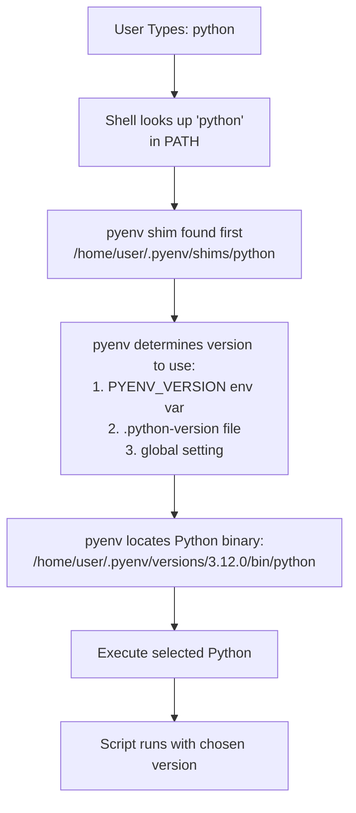
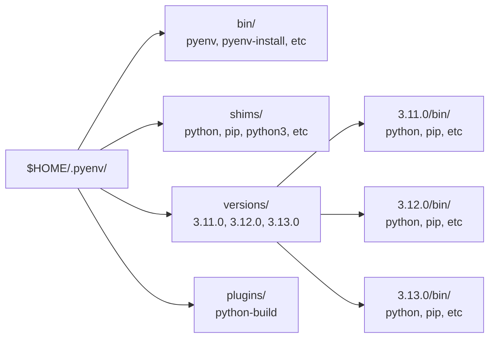
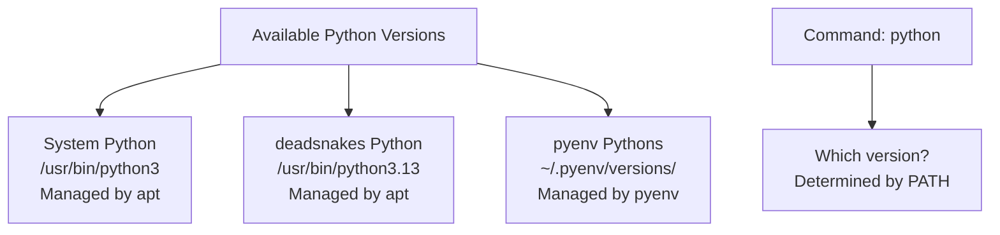
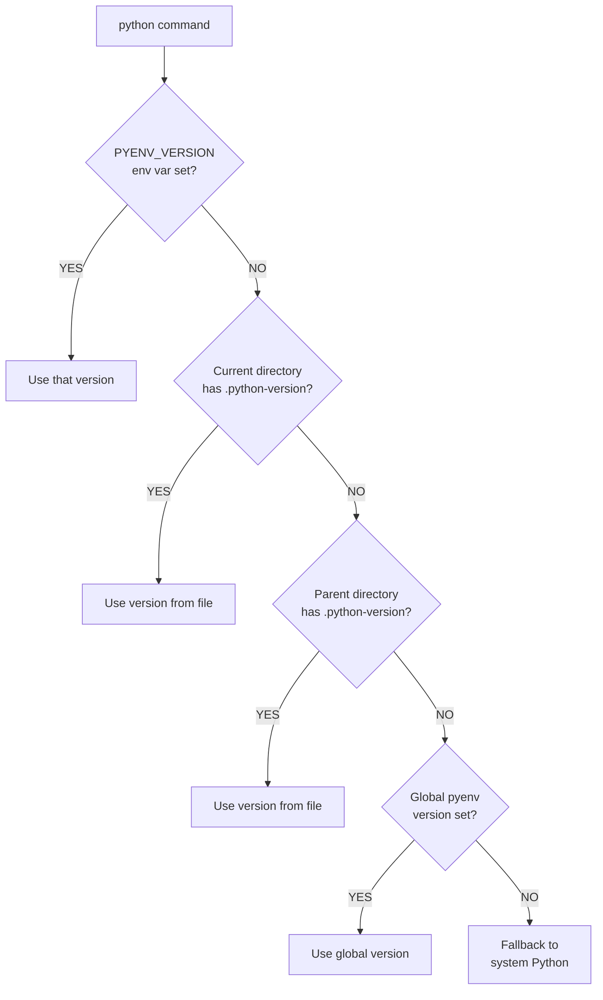
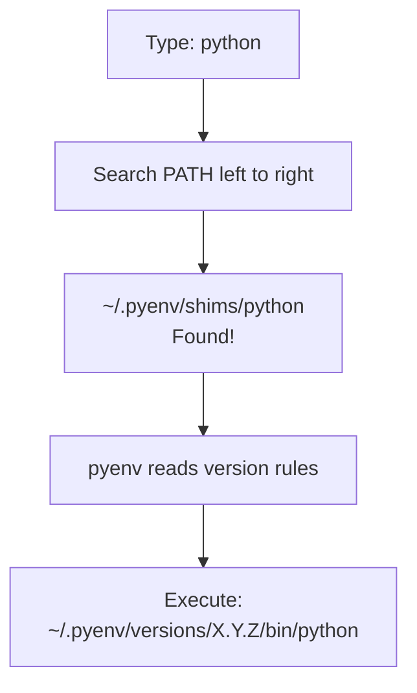
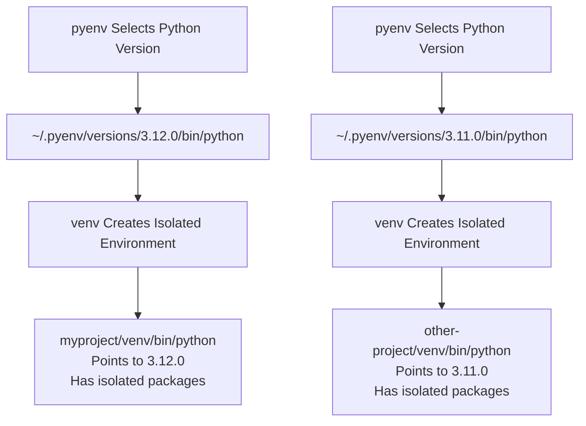

# 🔄 pyenv: Python Version Management

A comprehensive guide to understanding and using pyenv for managing multiple Python versions on your system. pyenv is the industry-standard tool for Python development, allowing you to seamlessly switch between different Python versions on a per-project basis.

**← Back to**: [WSL Installation](./wsl-installation.md) | [Python Fundamentals](./README.md)

---

## 📚 What You'll Learn

### What is pyenv?

**pyenv** is a simple yet powerful tool that lets you install and manage multiple Python versions on a single machine without interfering with your system Python.

**Key Characteristics:**

- **Version Multiplexing**: Run multiple Python versions simultaneously
- **Lightweight**: No large virtual machines or containers
- **Cross-Platform**: Works on macOS, Linux, and Windows (via WSL)
- **Per-Project Isolation**: Set different Python versions for different projects
- **Non-Invasive**: Doesn't modify your system Python; system packages remain independent

**Why Use pyenv?**

In AI/ML development, different projects often require different Python versions:
- **TensorFlow 2.x** might require Python 3.11
- **Newer PyTorch** might require Python 3.12
- **Legacy projects** might be locked to Python 3.9
- **Cutting-edge tools** might require Python 3.13

Without pyenv, managing these versions becomes a nightmare. With pyenv, you simply specify the version per project.

---

### How pyenv Works

pyenv operates by inserting itself into your shell's command resolution path. Here's the architectural overview:



**How pyenv Intercepts Commands:**

1. **Shims** - Small scripts in `~/.pyenv/shims/` that act as proxies
2. **Version Detection** - Checks where the Python version should come from (in priority order)
3. **Binary Location** - Finds and executes the correct Python binary
4. **Transparent** - You don't need to change your scripts; `python` always works correctly

**Mermaid Diagram: pyenv File Structure**



---

### How Multiple Python Versions Coexist

#### System Python vs. pyenv Pythons

Your system has multiple Python installations that operate independently:



**When You Use pyenv:**

1. **Shell PATH** is modified to check `~/.pyenv/shims/` first
2. **Shims intercept** `python`, `pip`, `python3`, etc.
3. **pyenv evaluates** which version to use
4. **Correct binary** is executed from `~/.pyenv/versions/X.Y.Z/bin/`

#### Version Priority (Decision Tree)

When you run `python`, pyenv checks in this order:



**Practical Example:**

```bash
# Global setting
pyenv global 3.13.0

# Project A
cd ~/projects/projectA
pyenv local 3.12.0  # Override global for this directory

# Project B
cd ~/projects/projectB
pyenv local 3.11.0  # Different version

# Temporary override
PYENV_VERSION=3.10.0 python script.py  # Uses 3.10.0 just this once
```

---

### Paths and Environment Variables

#### pyenv Directory Structure

```
$HOME/.pyenv/
├── bin/                      # pyenv executables
│   ├── pyenv               # Main pyenv command
│   ├── pyenv-install       # Install new Python versions
│   ├── pyenv-uninstall     # Remove Python versions
│   └── pyenv-versions      # List installed versions
│
├── shims/                   # Command proxies (added to PATH)
│   ├── python              # Shim for python
│   ├── python3             # Shim for python3
│   ├── python3.11          # Shim for python3.11
│   ├── pip                 # Shim for pip
│   └── pip3                # Shim for pip3
│
├── versions/               # Actual Python installations
│   ├── 3.11.0/
│   │   ├── bin/
│   │   │   ├── python      # Python binary
│   │   │   ├── pip         # pip binary
│   │   │   └── ...
│   │   ├── lib/
│   │   ├── include/
│   │   └── share/
│   ├── 3.12.0/
│   │   └── bin/
│   │       └── python
│   └── 3.13.0/
│       └── bin/
│           └── python
│
└── plugins/                # pyenv extensions
    └── python-build/      # Plugin to build Python from source
```

#### Environment Variables

**Key pyenv Environment Variables:**

```bash
# Current working directory or parents contain .python-version
PYENV_VERSION=3.12.0

# Override shell for subshells
PYENV_SHELL=bash

# Path where pyenv stores versions (rarely changed)
PYENV_ROOT=~/.pyenv

# Suppress version hints
PYENV_VERSION_QUIET=1
```

**Shell Configuration (Added to ~/.bashrc or ~/.zshrc):**

```bash
# Initialize pyenv
export PYENV_ROOT="$HOME/.pyenv"
export PATH="$PYENV_ROOT/bin:$PATH"

# Initialize pyenv in current shell
eval "$(pyenv init --path)"
eval "$(pyenv init -)"
```

**What These Lines Do:**

| Line | Purpose |
|------|---------|
| `export PYENV_ROOT="$HOME/.pyenv"` | Tells pyenv where to store versions (usually `~/.pyenv`) |
| `export PATH="$PYENV_ROOT/bin:$PATH"` | Adds pyenv commands to PATH |
| `eval "$(pyenv init --path)"` | Sets up PATH to include shims (bare shells) |
| `eval "$(pyenv init -)"` | Sets up completions and integrations (interactive shells) |

#### How PATH Resolution Works

When you type `python`, your shell searches PATH in order:

```
$PATH = /home/user/.pyenv/shims:/usr/local/bin:/usr/bin:/bin

Search order:
1. /home/user/.pyenv/shims/python      ✓ FOUND (pyenv shim)
   └─> Hands off to pyenv to determine version

(Never gets to step 2 because already found)
2. /usr/local/bin/python
3. /usr/bin/python                     (System Python)
4. /bin/python
```

**Visual PATH Resolution:**



#### Viewing Active Python Information

```bash
# Show which Python is active
which python
# Output: /home/user/.pyenv/shims/python

# Show the actual executable being used
pyenv which python
# Output: /home/user/.pyenv/versions/3.12.0/bin/python

# List all installed versions
pyenv versions
# Output:
#   3.11.0
#   3.12.0
# * 3.13.0  (marked with * = active global)

# Show version of active Python
python --version
# Output: Python 3.13.0
```

---

### Installation and Setup

#### Prerequisites

Before installing pyenv, ensure build dependencies are available:

```bash
# Update package list
sudo apt update

# Install build dependencies
sudo apt install -y make build-essential libssl-dev zlib1g-dev \
libbz2-dev libreadline-dev libsqlite3-dev wget curl llvm \
libncursesw5-dev xz-utils tk-dev libxml2-dev libxmlsec1-dev \
libffi-dev liblzma-dev
```

**What These Dependencies Do:**

| Package | Purpose |
|---------|---------|
| `build-essential` | GCC compiler, make, build tools |
| `libssl-dev` | OpenSSL library (required for secure connections) |
| `zlib1g-dev` | Compression library |
| `libreadline-dev` | Line editing library (for Python interactive shell) |
| `libsqlite3-dev` | SQLite library (for Python's sqlite3) |
| `tk-dev` | Tkinter GUI support |
| `libxml2-dev` | XML parsing library |
| `libffi-dev` | Foreign function interface (for cffi module) |

#### Installation Steps

```bash
# Clone pyenv from GitHub
curl https://pyenv.run | bash

# Add pyenv to shell (add these lines to ~/.bashrc)
echo 'export PYENV_ROOT="$HOME/.pyenv"' >> ~/.bashrc
echo 'export PATH="$PYENV_ROOT/bin:$PATH"' >> ~/.bashrc
echo 'eval "$(pyenv init --path)"' >> ~/.bashrc
echo 'eval "$(pyenv init -)"' >> ~/.bashrc

# Reload shell configuration
source ~/.bashrc

# Verify installation
pyenv --version
# Output: pyenv 2.4.0
```

---

### Common pyenv Commands

#### Managing Versions

```bash
# Install a Python version
pyenv install 3.13.0

# Install and see progress
pyenv install -v 3.13.0

# List available versions to install
pyenv install --list

# List installed versions
pyenv versions

# Uninstall a version
pyenv uninstall 3.11.0
```

#### Setting Active Versions

```bash
# Set global version (entire system)
pyenv global 3.13.0

# Set local version (current directory and subdirs)
pyenv local 3.12.0

# Set shell version (current terminal session only)
pyenv shell 3.11.0

# Unset local version
pyenv local --unset
```

#### Checking Active Version

```bash
# Show which Python command will run
pyenv which python
# Output: /home/user/.pyenv/versions/3.12.0/bin/python

# Show all details
pyenv version
# Output: 3.12.0 (set by /home/projects/myapp/.python-version)

# Show current version
python --version
```

#### Viewing .python-version Files

```bash
# Show local version file
cat .python-version
# Output: 3.12.0

# Show what pyenv is actually using
pyenv version-name
# Output: 3.12.0
```

---

### Real-World Workflow Example

**Scenario**: You have two AI projects with different Python requirements.

```bash
# Install multiple Python versions once
pyenv install 3.11.0
pyenv install 3.12.0

# Project 1: TensorFlow (requires 3.11)
mkdir ~/projects/tf-project
cd ~/projects/tf-project
pyenv local 3.11.0
echo "3.11.0" > .python-version  # Creates local version file

# Create virtual environment with project's Python
python -m venv venv
source venv/bin/activate
pip install tensorflow

# Project 2: PyTorch (requires 3.12)
mkdir ~/projects/torch-project
cd ~/projects/torch-project
pyenv local 3.12.0
echo "3.12.0" > .python-version

# Create virtual environment with project's Python
python -m venv venv
source venv/bin/activate
pip install torch

# Switch between projects (Python version changes automatically)
cd ~/projects/tf-project
python --version      # Output: Python 3.11.0

cd ~/projects/torch-project
python --version      # Output: Python 3.12.0

cd ~/projects/tf-project
python --version      # Output: Python 3.11.0 (switched back!)
```

---

### Integration with Virtual Environments

**Important**: pyenv manages *Python interpreters*, while venv manages *package isolation*.



**Workflow:**

```bash
# 1. Use pyenv to select Python version
pyenv local 3.12.0

# 2. Create virtual environment (uses the selected Python)
python -m venv venv

# 3. Activate venv (now you're isolated)
source venv/bin/activate

# 4. Install packages (isolated to this venv)
pip install requests numpy

# 5. Verify which Python you're using
which python
# Output: /home/user/projects/myproject/venv/bin/python

# 6. That Python is based on the pyenv version
~/.pyenv/versions/3.12.0/bin/python --version
# Output: Python 3.12.0
```

---

### Troubleshooting

**Issue 1: "command not found: pyenv"**

```bash
# Problem: pyenv not in PATH
# Solution: Check ~/.bashrc has pyenv initialization

# Verify
cat ~/.bashrc | grep "pyenv init"

# If missing, add it:
echo 'eval "$(pyenv init --path)"' >> ~/.bashrc
source ~/.bashrc
```

**Issue 2: "Python not found after install"**

```bash
# Problem: pyenv installed Python but shim not found
# Solution: Verify pyenv shims are in PATH

which python
# Should output: /home/user/.pyenv/shims/python

# If not, PATH is wrong:
echo $PATH | grep shims
# Should contain: /home/user/.pyenv/shims

# Fix: Add to ~/.bashrc
export PATH="$PYENV_ROOT/bin:$PATH"
source ~/.bashrc
```

**Issue 3: "Permission denied" when installing Python**

```bash
# Problem: Build dependencies missing
# Solution: Install required packages

sudo apt install -y make build-essential libssl-dev zlib1g-dev \
libbz2-dev libreadline-dev libsqlite3-dev wget curl llvm \
libncursesw5-dev xz-utils tk-dev libxml2-dev libxmlsec1-dev \
libffi-dev liblzma-dev

# Retry installation
pyenv install 3.13.0
```

**Issue 4: "Using system python instead of pyenv version"**

```bash
# Problem: System Python appears in PATH before pyenv shims
# Debug: Check PATH order

echo $PATH

# Should show shims first:
# /home/user/.pyenv/shims:/usr/local/bin:/usr/bin:/bin

# If not, add initialization to ~/.bashrc:
export PATH="$PYENV_ROOT/bin:$PATH"
eval "$(pyenv init --path)"
source ~/.bashrc
```

---

## 🔗 Learning Resources

### Official Documentation

- [pyenv GitHub Repository](https://github.com/pyenv/pyenv) - Official pyenv project
- [pyenv Wiki](https://github.com/pyenv/pyenv/wiki) - Comprehensive documentation
- [pyenv Installer](https://github.com/pyenv/pyenv-installer) - Easy installation script
- [Python Build Dependencies](https://github.com/pyenv/pyenv/wiki#suggested-build-environment) - Required packages per OS

### Guides and Tutorials

- [Real Python: pyenv Setup](https://realpython.com/intro-to-pyenv/) - Beginner-friendly guide
- [Full Stack Python: pyenv](https://www.fullstackpython.com/application-dependencies.html#pyenv) - Integration with Python projects
- [Automate the Boring Stuff: Python Installation](https://automatetheboringstuff.com/appendixb/) - Beginner setup

### Advanced Topics

- [pyenv-virtualenv](https://github.com/pyenv/pyenv-virtualenv) - Combining pyenv with virtualenv
- [pyenv-virtualenvwrapper](https://github.com/pyenv/pyenv-virtualenvwrapper) - Integration with virtualenvwrapper
- [pyenv with Docker](https://github.com/pyenv/pyenv/wiki/Docker-friendly-setup) - Using pyenv in containers

---

## ✅ Learning Checklist

### Understanding pyenv

- [ ] Understand what pyenv does (manages multiple Python versions)
- [ ] Know how pyenv intercepts commands (shims in PATH)
- [ ] Understand version priority (PYENV_VERSION → .python-version → global)
- [ ] Know where pyenv stores files (~/.pyenv/)
- [ ] Understand shims vs actual binaries

### Installation

- [ ] Install build dependencies: `sudo apt install` (full list)
- [ ] Install pyenv: `curl https://pyenv.run | bash`
- [ ] Add to ~/.bashrc: `eval "$(pyenv init --path)"` and `eval "$(pyenv init -)"`
- [ ] Reload shell: `source ~/.bashrc`
- [ ] Verify: `pyenv --version`

### Using pyenv

- [ ] List available versions: `pyenv install --list`
- [ ] Install Python version: `pyenv install 3.13.0`
- [ ] List installed versions: `pyenv versions`
- [ ] Set global version: `pyenv global 3.13.0`
- [ ] Verify global version: `python --version`

### Per-Project Setup

- [ ] Create project directory: `mkdir ~/projects/myapp`
- [ ] Set local Python version: `pyenv local 3.12.0`
- [ ] Verify local version: `cat .python-version`
- [ ] Create virtual environment: `python -m venv venv`
- [ ] Activate venv: `source venv/bin/activate`
- [ ] Install package: `pip install requests`
- [ ] Verify venv is active: `which python` (should show venv path)

### Paths and Environment Variables

- [ ] Know pyenv root location: `echo $PYENV_ROOT`
- [ ] Understand shims directory: `ls ~/.pyenv/shims/`
- [ ] Understand versions directory: `ls ~/.pyenv/versions/`
- [ ] Know how PATH resolution works
- [ ] Check which Python is active: `which python` and `pyenv which python`

### Switching Versions

- [ ] Switch globally: `pyenv global 3.12.0`
- [ ] Switch per-project: `pyenv local 3.11.0`
- [ ] Temporary switch: `PYENV_VERSION=3.10.0 python`
- [ ] Unset local version: `pyenv local --unset`
- [ ] Verify switch worked: `python --version`

### Integration with venv

- [ ] Create venv with pyenv Python: `python -m venv venv`
- [ ] Activate venv: `source venv/bin/activate`
- [ ] Verify using correct Python: `which python`
- [ ] Install packages in venv: `pip install package_name`
- [ ] Deactivate venv: `deactivate`

### Real-World Workflow

- [ ] Create first project with specific Python version
- [ ] Create second project with different Python version
- [ ] Switch between projects and verify Python versions change
- [ ] Create venvs in both projects
- [ ] Activate venvs and install packages
- [ ] Verify isolation (packages not shared between projects)

### Troubleshooting

- [ ] Know how to debug PATH: `echo $PATH`
- [ ] Know how to check which python: `which python` vs `pyenv which python`
- [ ] Know how to install missing dependencies
- [ ] Know how to verify pyenv is initialized in shell

---

## 📊 Quick Reference

### pyenv vs System Python vs deadsnakes

```
System Python (/usr/bin/python3)
├─ Provided by Ubuntu
├─ Managed by apt
├─ Shared across system
└─ No version switching

deadsnakes Python (/usr/bin/python3.13)
├─ Installed via PPA
├─ Managed by apt
├─ Requires separate install per version
└─ Manual switching in PATH

pyenv Python (~/.pyenv/versions/3.13.0/bin/python)
├─ Self-contained installation
├─ Managed by pyenv
├─ All versions in one location
├─ Automatic switching via shims
└─ Per-project version control
```

---

*Last updated: 2025-11-10*
