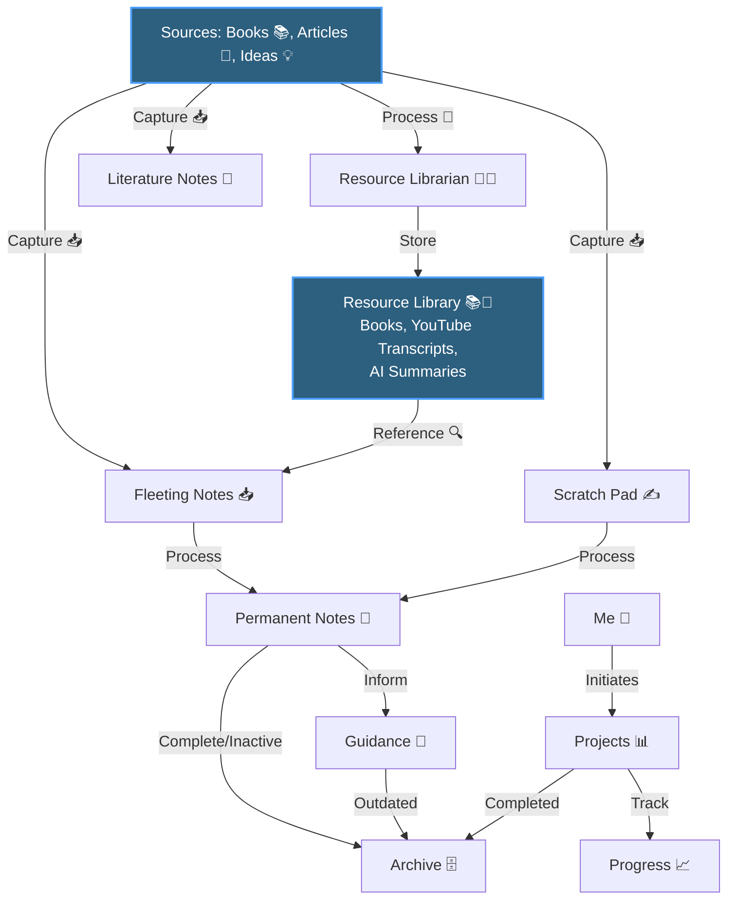

# 📚 Knowledge Library

I built this knowledge management system by blending **PARA** and **Zettelkasten** frameworks with my own methods. It goes beyond simply managing and storing knowledge — it's about transforming what we learn into **practical systems, operating procedures, and guides** that can be **applied to improve how we live and work**. Each part of the system is designed to help capture ideas and turn them into meaningful actions that create progress and clarity across all areas of life.

## 🧾 Format

I experimented with many note-taking applications such as **Notion** and **Bear**, but ultimately chose **Markdown files** as the foundation of this system. Every note is formatted as clean, interconnected markdown that's both human-readable and AI-friendly. This transforms a PKM from a closed platform into an open, machine-processable knowledge base optimized for the AI era.

### Why Markdown

* **AI Integration** – Structured markdown designed to work seamlessly with LLMs and AI tools for enhanced reasoning and knowledge retrieval.
* **Machine Readability** – Plain text format that can be processed by scripts, APIs, and automated systems.
* **Portability** – No vendor lock-in; your knowledge exists as simple files you own completely.
* **Git Version Control** – Full history, branching, and collaboration through GitHub.
* **Durability** – Your notes remain accessible and processable regardless of service availability.

## 🎯 System Purpose

This system is designed to help **Capture, Organise, Connect, and Apply** knowledge efficiently using principles from **Zettelkasten** and the **PARA Method**. Its primary goal is to transform fleeting thoughts and consumed information into structured insights and actionable guidance.

## 🔄 Knowledge Flow

### 📥 Capture

* **From Ideas 💡** → Drop quick thoughts into **Fleeting Notes** or **Scratch Pad**
* **From Books 📚 and Articles 📰** → Summarize key points into **Literature Notes**

### 📋 Organise

* Review captured notes periodically
* If valuable: Refine and store as structured insights in **Permanent Notes**

### 🛠️ Apply

* Use **Guidance** notes as blueprints to drive decisions, plans, and routines
* Log activities, milestones, and outcomes in **Progress**

### 💃 Archive

* Move completed or inactive information to **Archive** for long-term reference

---

## 📂 How It's Organized

### 📥 [Fleeting Notes](./01-fleeting-notes/README.md)

Quick capture inbox for thoughts, ideas, and temporary snippets. Reviewed regularly for archival and development into permanent notes.

### 📚 [Literature Notes](./02-literature-notes/README.md)

Curated summaries of books, articles, courses, and other resources. Starting points for deeper research and sources for permanent notes.

### 🧠 [Permanent Notes](./03-permanent-notes/README.md)

My knowledge library organized by topic. Well-formed, structured insights ready for reference and application.

**Topics Include:**

* 🏢 **Professional** - Career, management, technical skills, workplace dynamics, finance
* 🌟 **Personal Development** - Social skills, interpersonal growth, self-awareness
* 🏥 **Wellbeing** - Sleep, fitness, mindfulness, mental health
* 📚 **Productivity** - Time management, goal setting, deep work, focus
* 👶 **Parenting** - Child development, behavior, emotional health
* 🎭 **Leisure** - Hobbies, travel, entertainment, books, media

### 🧑‍🗾 [Guidance](./04-guidance/README.md)

Your personal **operations manual** — blueprints and procedures for living intentionally. SOPs, workflows, frameworks, and decision guides **mirroring the same topics as Permanent Notes**.

**Guidance Topics (Parallel to Permanent Notes):**

* 🏢 [Professional](./04-guidance/professional/README.md) - Career workflows & SOPs
* 🌟 [Personal Development](./04-guidance/personal-development/README.md) - Growth routines & guides
* 🏥 [Wellbeing](./04-guidance/wellbeing/README.md) - Health & fitness procedures
* 📚 [Productivity](./04-guidance/productivity/README.md) - Work systems & routines
* 👶 [Parenting](./04-guidance/parenting/README.md) - Parenting procedures & frameworks
* 🎭 [Leisure](./04-guidance/leisure/README.md) - Hobby & travel routines

**Plus:**

* 📚 [Cheat Sheets](./04-guidance/cheat-sheets/README.md) - Quick reference guides

### 🎯 [Projects](./05-projects/README.md)

Active and past projects with progress tracking, milestones, and key learnings.

### 📊 [Tracking & Reviews](./06-tracking/README.md)

Goals, habit tracking, weekly reviews, and annual reflections. Measurement and accountability space.

### 📦 [Archive](./07-archive/README.md)

Deprecated content and outdated notes kept for historical reference.

---

## ✅ Why This Structure Works

* **Zettelkasten principles** ensure knowledge grows **organically** and **connects**
* **PARA structure** keeps actions and resources separate but aligned
* Focuses equally on **thinking** (Scratch Pad), **learning** (Literature Notes), **building knowledge** (Permanent Notes), and **applying knowledge** (Guidance and Progress)

---

## 📋 System Details

### Core Principles

* 📑 **One README.md per folder** - Every folder has a clear entry point and navigation hub
* 🔗 **Relative markdown links** - All links use relative paths, making the system portable
* 🎨 **Beautiful, consistent formatting** - All notes follow the same templates and structure
* 💎 **Atomic notes** - Each note covers one main idea or topic
* 🕸️ **Interconnected** - Notes link to related concepts across the system

### Framework

This system combines two proven knowledge management approaches:

* 📇 **Zettelkasten** - Atomic, interconnected notes that build knowledge over time
* 📦 **PARA Method** - Organization by Project, Area, Resource, and Archive

### Tools & Tech

* 📄 **Format:** Standard markdown (`.md`)
* 🔄 **Version Control:** Git
* 👁️ **Viewing:** Works with any markdown viewer (GitHub, VS Code, Obsidian, etc.)
* 🔓 **No vendor lock-in:** Everything is portable and open

---

## 📝 Templates

All new content should follow the templates in [`.templates/`](./.templates/):

* **`note.md`** - For permanent knowledge notes
* **`literature-summary.md`** - For book/article summaries
* **`project.md`** - For tracking projects
* **`daily-note.md`** - For fleeting thoughts and daily captures
* **`README.md`** - For folder navigation hubs

---

## 🤝 How to Use This System

Pick your use case and dive in:

### 📥 **Daily Capture** — Quick idea collection

1. 💡 Capture quick thoughts in [Fleeting Notes](./01-fleeting-notes/README.md)
2. 🔄 Periodically review and develop promising ideas
3. 🔗 Link new insights to existing knowledge

### 📚 **Learning** — From sources to structured knowledge

1. 📖 Create [Literature Notes](./02-literature-notes/README.md) for books & articles
2. 🧠 Extract key concepts into [Permanent Notes](./03-permanent-notes/README.md)
3. 🔗 Connect to existing knowledge through relationships

### 🛠️ **Guidance** — Theory into practice

1. ⚙️ Reference [Guidance](./04-guidance/README.md) for procedures & frameworks
2. 📝 Create cheat sheets for frequently needed info
3. 🔄 Document your workflows and decision-making

### 📊 **Projects** — Building things

1. 🚀 Start with a [Project](./05-projects/README.md) template
2. 📈 Track progress and milestones
3. 💎 Capture learnings as you go

### 📈 **Review** — Reflect and iterate

1. 📅 Regular [Weekly Reviews](./06-tracking/weekly-reviews/README.md)
2. 🗓️ Monthly and annual reflections
3. 🎯 Track goals and habit streaks

---

## 🖖️ See Also

* [CONTRIBUTING.md](./CONTRIBUTING.md) - Style guide and guidelines
* [.templates/](./.templates/) - All markdown templates

---

*Created: 2025-11-03*
*Framework: Zettelkasten × PARA Hybrid*
