# 📚 Knowledge Library

A beautifully formatted, git-based personal knowledge management system using the Zettelkasten × PARA framework. This system captures, organizes, connects, and applies knowledge across all areas of life.

## 🌟 Why This Exists

This repo replaces my Notion PKM with a more portable, git-friendly system while improving and curating the content along the way. Every note is beautifully formatted markdown, interconnected, and version-controlled.

## 🎯 System Purpose

This system is designed to help **Capture, Organise, Connect, and Apply** knowledge efficiently using principles from **Zettelkasten** and the **PARA Method**. Its primary goal is to transform fleeting thoughts and consumed information into structured insights and actionable guidance.

## 🔄 Knowledge Flow

```mermaid
graph TD
    Sources[Sources: Books 📚, Articles 📰, Ideas 💡]
    Sources -- Capture 📥 --> A1[Fleeting Notes 📥]
    Sources -- Capture 📥 --> A2[Scratch Pad ✍️]
    Sources -- Capture 📥 --> A3[Literature Notes 📖]
    Human[Me 🧑] -- Creates --> A4[Guidance 📜]
    Human -- Initiates --> P[Projects 📊]

    A1 -- Organise --> B1[Permanent Notes 📂]
    A2 -- Organise --> B1

    A4[Guidance 📜] -- recorded --> B3[Progress 📈]
    B1 -- Complete/Inactive --> Archive[Archive 🗄️]
    A4 -- Outdated --> Archive
    P -- Completed --> Archive
```

## 📂 How It's Organized

### 📥 [Fleeting Notes](./01-fleeting-notes/index.md)
Quick capture inbox for thoughts, ideas, and temporary snippets. Reviewed regularly for archival and development into permanent notes.

### 📚 [Literature Notes](./02-literature-notes/index.md)
Curated summaries of books, articles, courses, and other resources. Starting points for deeper research and sources for permanent notes.

### 🧠 [Permanent Notes](./03-permanent-notes/index.md)
My knowledge library organized by topic. Well-formed, structured insights ready for reference and application.

**Topics Include:**
- **Profession** - Management, technical skills, interviewing
- **Personal Development** - Learning, productivity, wellbeing, parenting
- **Leisure** - Books, travel, entertainment
- **AI Engineering** - In-depth learning path covering modern AI systems

### 🧭 [Guidance](./04-guidance/index.md)
Blueprints and operating procedures for how you run your life. Cheat sheets, workflows, frameworks, and decision guides.

### 🎯 [Projects](./05-projects/index.md)
Active and past projects with progress tracking, milestones, and key learnings.

### 📊 [Tracking & Reviews](./06-tracking/index.md)
Goals, habit tracking, weekly reviews, and annual reflections. Measurement and accountability space.

### 📦 [Archive](./07-archive/index.md)
Deprecated content and outdated notes kept for historical reference.

---

## 📌 Example Workflow

### 📥 Capture
- **From Ideas 💡** → Drop quick thoughts into **Fleeting Notes** or **Scratch Pad**
- **From Books 📚 and Articles 📰** → Summarize key points into **Literature Notes**

### 🔄 Process
- Review captured notes periodically
- If valuable: Refine and store as structured insights in **Permanent Notes**

### 🛠️ Apply
- Use **Guidance** notes as blueprints to drive decisions, plans, and routines
- Log activities, milestones, and outcomes in **Progress**

### 🗃️ Archive
- Move completed or inactive information to **Archive** for long-term reference

## ✅ Why This Structure Works

- **Zettelkasten principles** ensure knowledge grows **organically** and **connects**
- **PARA structure** keeps actions and resources separate but aligned
- Focuses equally on **thinking** (Scratch Pad), **learning** (Literature Notes), **building knowledge** (Permanent Notes), and **applying knowledge** (Guidance and Progress)

## 🚀 Quick Start

1. **Explore by topic:** Browse any folder and start with its `index.md` for an overview
2. **Follow connections:** Look for "Related Notes" sections to jump between topics
3. **Search:** Use Ctrl+F or GitHub's search to find specific topics
4. **Contribute:** See [CONTRIBUTING.md](./CONTRIBUTING.md) for style guidelines

---

## 📋 System Details

### Core Principles

- **One index.md per folder** - Every folder has a clear entry point and navigation hub
- **Relative markdown links** - All links use relative paths, making the system portable
- **Beautiful, consistent formatting** - All notes follow the same templates and structure
- **Atomic notes** - Each note covers one main idea or topic
- **Interconnected** - Notes link to related concepts across the system

### Framework

This system combines two proven knowledge management approaches:

- **Zettelkasten** - Atomic, interconnected notes that build knowledge over time
- **PARA Method** - Organization by Project, Area, Resource, and Archive

### Tools & Tech

- **Format:** Standard markdown (`.md`)
- **Version Control:** Git
- **Viewing:** Works with any markdown viewer (GitHub, VS Code, Obsidian, etc.)
- **No vendor lock-in:** Everything is portable and open

---

## 📝 Templates

All new content should follow the templates in [`.templates/`](./.templates/):

- **`note.md`** - For permanent knowledge notes
- **`literature-summary.md`** - For book/article summaries
- **`project.md`** - For tracking projects
- **`daily-note.md`** - For fleeting thoughts and daily captures
- **`index.md`** - For folder navigation hubs

---

## 🗂️ Navigation by Topic

**Professional Development:**
- [Profession Overview](./03-permanent-notes/profession/index.md)
- [Management Skills](./03-permanent-notes/profession/management/index.md)
- [Technical Skills](./03-permanent-notes/profession/technical-skills/index.md)
- [Interview Preparation](./03-permanent-notes/profession/interviewing/index.md)

**Personal Growth:**
- [Learning & Memory](./03-permanent-notes/personal-development/learning/index.md)
- [Productivity Systems](./03-permanent-notes/personal-development/productivity/index.md)
- [Wellbeing & Health](./03-permanent-notes/personal-development/wellbeing/index.md)
- [Parenting](./03-permanent-notes/personal-development/parenting/index.md)

**Technical Learning:**
- [AI Engineering](./03-permanent-notes/ai-engineering/index.md)
- [Python Programming](./03-permanent-notes/profession/technical-skills/python/index.md)

**Leisure & Personal:**
- [Books & Reading](./03-permanent-notes/leisure/books/index.md)
- [Travel](./03-permanent-notes/leisure/travel/index.md)
- [Entertainment](./03-permanent-notes/leisure/entertainment/index.md)

---

## 📊 Stats

- **Total Sections:** 7 main categories
- **Sub-categories:** 20+
- **Status:** Actively growing and evolving

---

## 🤝 How to Use This System

### For Daily Capture
1. Capture quick thoughts in [Fleeting Notes](./01-fleeting-notes/index.md)
2. Periodically review and develop promising ideas into permanent notes
3. Link new notes to existing knowledge

### For Learning
1. Create [Literature Notes](./02-literature-notes/index.md) for resources you read
2. Extract key concepts into [Permanent Notes](./03-permanent-notes/index.md)
3. Connect to existing knowledge through relationships

### For Guidance
1. Reference [Guidance](./04-guidance/index.md) for procedures and frameworks
2. Create cheat sheets for frequently needed info
3. Document your workflows and decision-making

### For Projects
1. Start with a [Project](./05-projects/index.md) template
2. Track progress and milestones
3. Capture learnings as you go

### For Review
1. Regular [Weekly Reviews](./06-tracking/weekly-reviews/index.md)
2. Monthly and annual reflections
3. Track goals and habit streaks

---

## 📖 See Also

- [PLAN.md](./PLAN.md) - Implementation plan and progress
- [CONTRIBUTING.md](./CONTRIBUTING.md) - Style guide and guidelines
- [.templates/](./.templates/) - All markdown templates

---

## ⚡ Get Started

Pick a topic that interests you and start reading. Each folder's `index.md` file provides context and links to related content.

---

*Created: 2025-11-03*
*Framework: Zettelkasten × PARA Hybrid*
