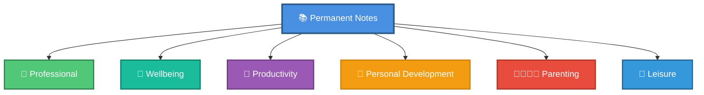

```mermaid
graph TD
    A["📚 Permanent Notes"] --> B["💼 Professional"]
    A --> G["💚 Wellbeing"]
    A --> C["🎯 Productivity"]
    A --> D["🌱 Personal Development"]
    A --> E["👨‍👩‍👧‍👦 Parenting"]
    A --> F["🎨 Leisure"]


    style A fill:#4A90E2,stroke:#2E5C8A,stroke-width:3px,color:#fff
    style B fill:#50C878,stroke:#2D7A4A,stroke-width:2px,color:#fff
    style C fill:#9B59B6,stroke:#6C3A7B,stroke-width:2px,color:#fff
    style D fill:#F39C12,stroke:#C87F0A,stroke-width:2px,color:#fff
    style E fill:#E74C3C,stroke:#A93226,stroke-width:2px,color:#fff
    style F fill:#3498DB,stroke:#1F5F8F,stroke-width:2px,color:#fff
    style G fill:#1ABC9C,stroke:#117A65,stroke-width:2px,color:#fff
```
